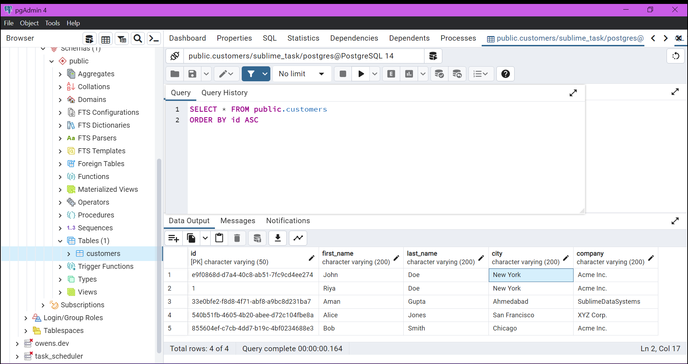
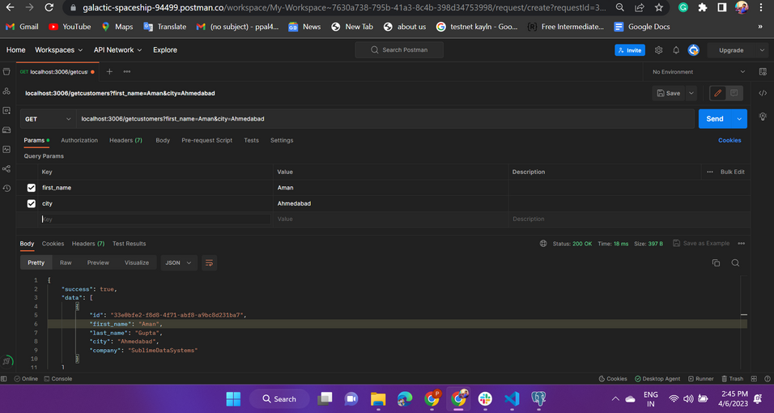
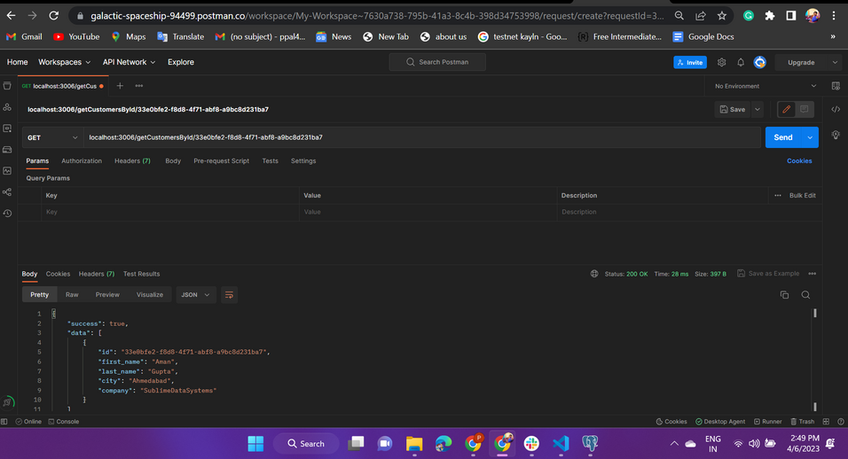
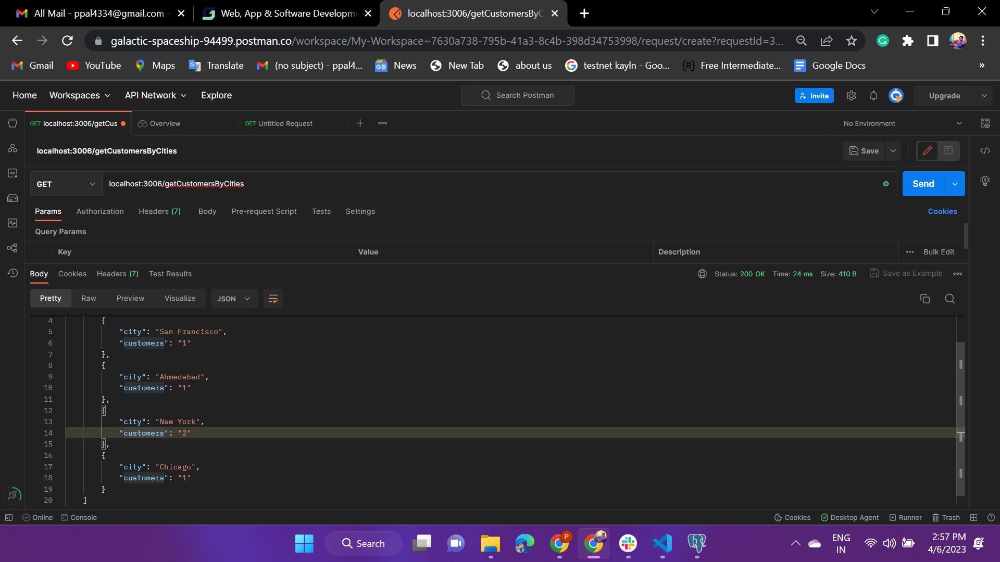
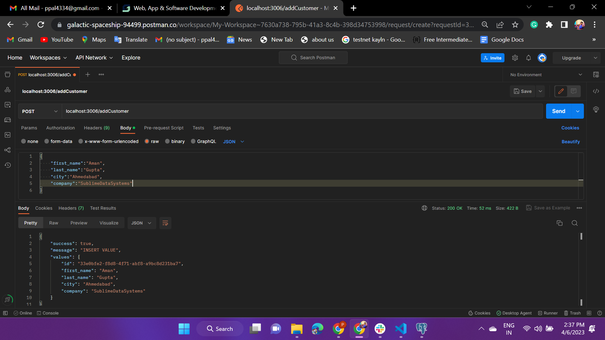

# sublime_task
Some small API's for customers

# Task 1 - setup database
 ```Create a customers.json file with multiple customers. Sample customer data. { id: 1, first_name: 'Aman', last_name: 'Gupta', city: 'Ahmedabad', company: 'SublimeDataSystems' } or You can use database of your choice and add the sample data in it.```




# Task 2 - Get Customer Details
``` Create a list API with search by first_name, last_name and city with pagination```



# Task 3 - Get Customer By Id
``` Create an API to get single customer data by its id.```



# Task 4 - Get Cities with Customers
```Create an API to list all the unique cities with number of customers from a particular city. ```



# Task 5 - Add Customer
``` Create an API to add a customer with validations. All fields required and the city and company should already exists for an existing customer.```



/*** CopyRights to Prashant Pal ***/ 